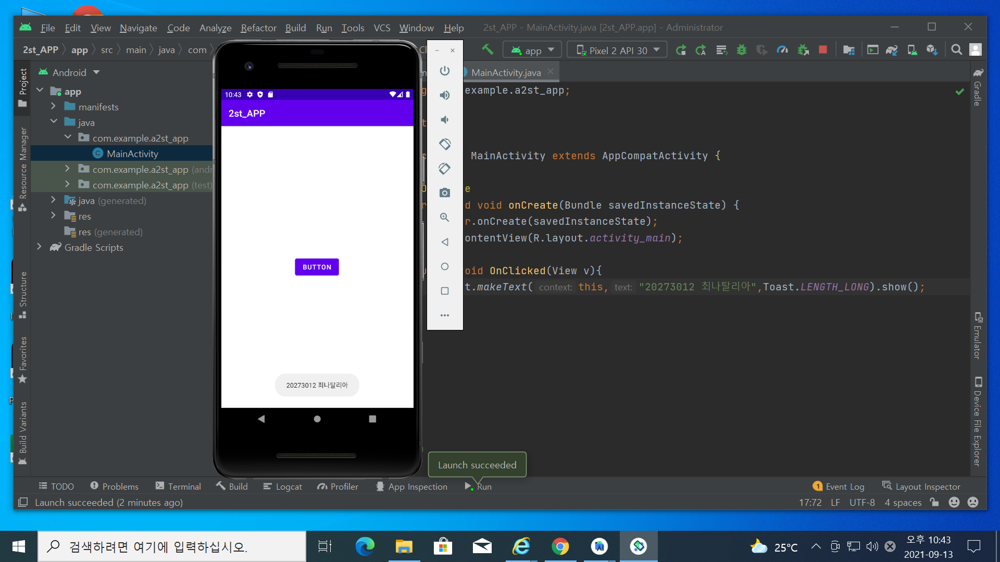
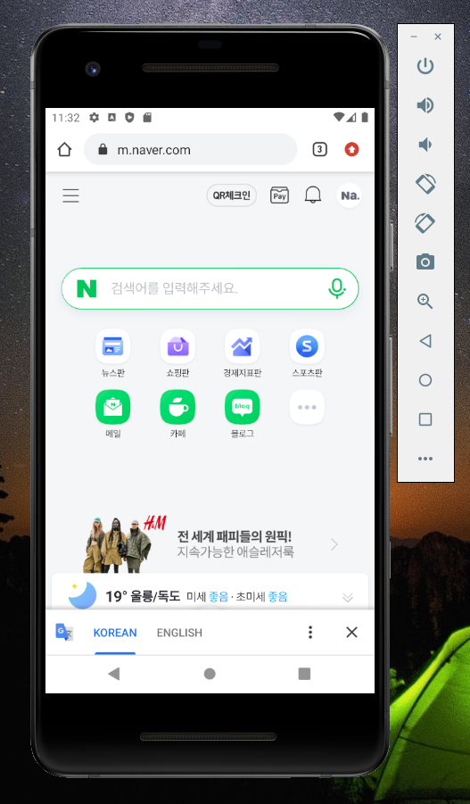
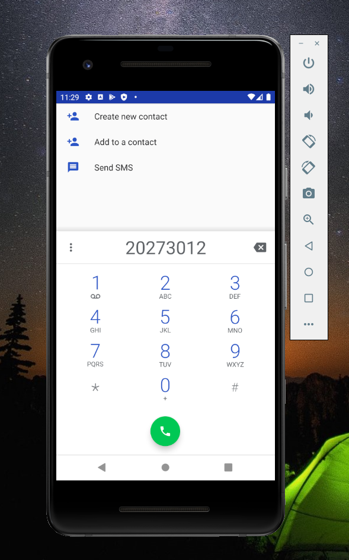
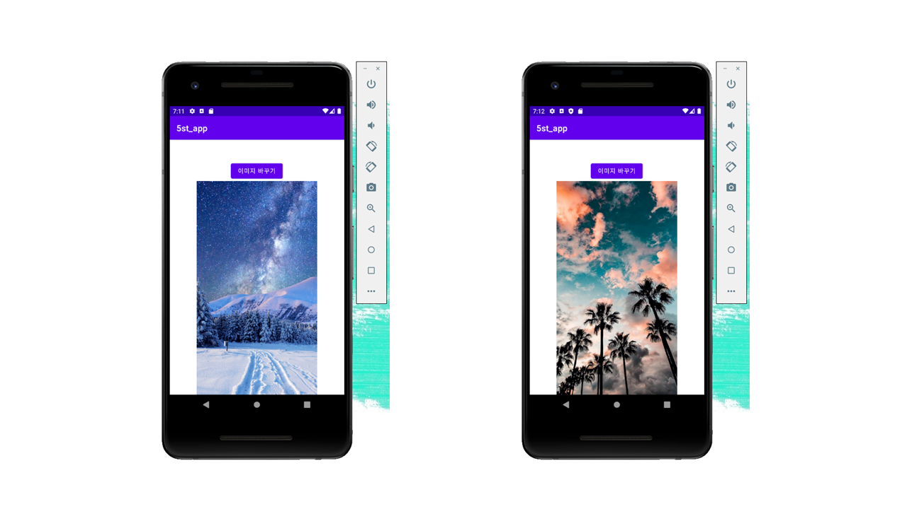
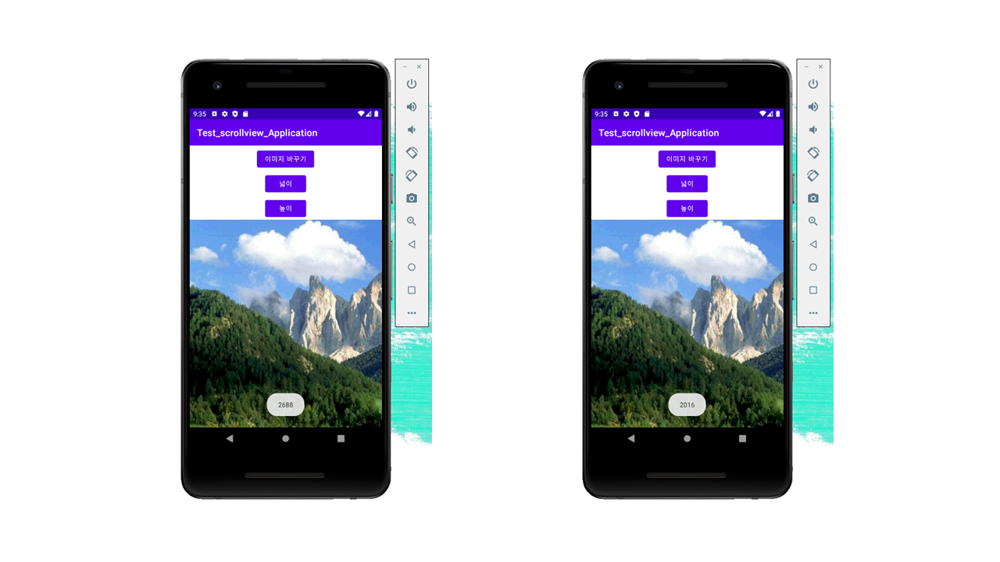
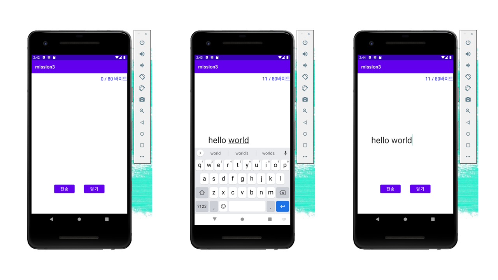

# 20273012_ria_androidApp
# 20273012 최나탈리아

## 1주차 과제

## 2주차 과제
  </img>
  
## 3주차 과제
  </img>
  </img>

## 4주차 과제

### 앱 이름: 세계 가이드(world guide)
코로나19 때문에 해외로 못 나가고, 지친 사람들 위해 스마트폰 만으로 다른 나라로 창문을 여러주는 앱이에요. 
앱 하나로 모든 나라의 역사, 문화, 관광지 등 한 눈으로 볼 수 있고. 
이 앱을 취미, 여행 계획, 교육 등으로 사용 할 수 있습니다.

## 5주차 과제
  </img>

## 6주차 과제
  </img>

## 7주차 과제
  </img>
